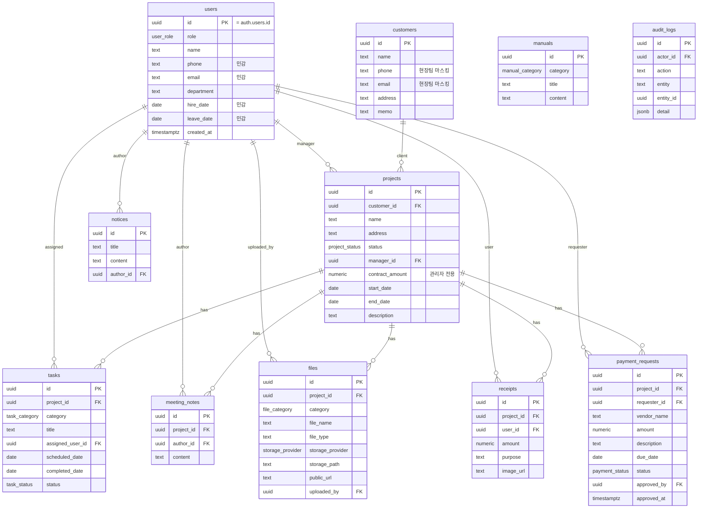

# JM OS v1.0 — ERD & 데이터 설계

모든 데이터는 **Project**를 중심으로 연결된다. 회계/급여는 외부(경리나라)에서 처리하므로 본 스키마에 포함하지 않는다.

## ER 다이어그램



## ENUM 정의

| 타입 | 값 |
|------|-----|
| `user_role` | representative(대표), director(이사), design(디자인), field(현장), accounting(경리) |
| `project_status` | inquiry, survey, design, estimate, contract, construction, completed |
| `task_category` | demolition, carpentry, electrical, plumbing, tile, painting, film, furniture, cleaning |
| `task_status` | pending, in_progress, completed, delayed |
| `payment_status` | requested, pending_approval, approved, paid, rejected |
| `file_category` | before, after, cad, render, meeting, receipt, doc |
| `storage_provider` | supabase, cloudflare_r2 |
| `manual_category` | company, design, construction |

## 접근 제어 매트릭스 (RLS)

> ⚠️ **이 표는 초기 설계안(목표)이며 실제 구현과 다릅니다.** 역할은 실제로 `admin/designer/field/partner`(+pending)이고, 테이블명도 다릅니다(customers/tasks/manuals 등은 미구현). **실제 적용된 RLS는 `docs/security_status.md`를 참고하세요** — admin전용(민감/재정), 본인데이터(알림·읽음), 역할별(금전·서류·현장자료), 채팅 참여자 기준, pending 업무데이터 차단. 아래 매트릭스는 향후 세분화(마스킹·경리 역할 등) 방향으로만 참고.

R=조회, W=생성/수정, –=불가, △=조건부(본인/마스킹)

| 테이블 | 대표 | 이사 | 디자인 | 현장 | 경리 |
|--------|:---:|:---:|:---:|:---:|:---:|
| users (개인정보) | RW | RW | △본인 | △본인 | △본인 |
| customers | RW | RW | RW | R(연락처 마스킹) | R(연락처 마스킹) |
| projects (계약금액) | RW | RW | RW | R(금액 마스킹) | R(금액 마스킹) |
| tasks | RW | RW | RW | RW | R |
| meeting_notes | RW | RW | RW | △작성자 | △작성자 |
| files | RW | RW | RW | RW | R |
| receipts | R전체 | R전체 | △본인 | △본인 | R전체 |
| payment_requests | RW(승인) | RW(승인) | △본인 | △본인 | RW(지급) |
| manuals / notices | RW | RW | R | R | R |
| audit_logs | R | R | – | – | – |

### 민감정보 컬럼 마스킹 (미구현 — 향후 방향)
> 현재는 `profiles.role` 기반 RLS(`my_role()` 헬퍼)로 **테이블/행 단위** 접근을 제어한다(단일 authenticated 전제는 더 이상 아님). 아래 컬럼 단위 마스킹(security_invoker 뷰)은 아직 미구현이며, 필요 시 후속 과제.

- `projects_v` — `contract_amount`는 관리자(대표/이사)에게만 노출
- `customers_v` — `phone`/`email`은 현장팀에게 NULL 마스킹
- `users_v` — `phone`/`email`/`hire_date`/`leave_date`는 관리자·본인에게만 노출

## 파일 저장 구조 (Supabase Storage)

```
/project/{project_id}/before/
/project/{project_id}/after/
/project/{project_id}/cad/
/project/{project_id}/render/
/project/{project_id}/meeting/
/project/{project_id}/receipt/
```

허용 형식: jpg, png, pdf, dwg, skp, xlsx, docx
